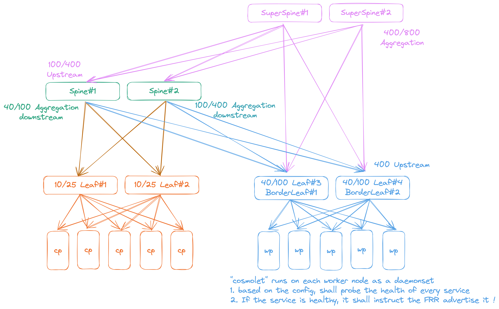
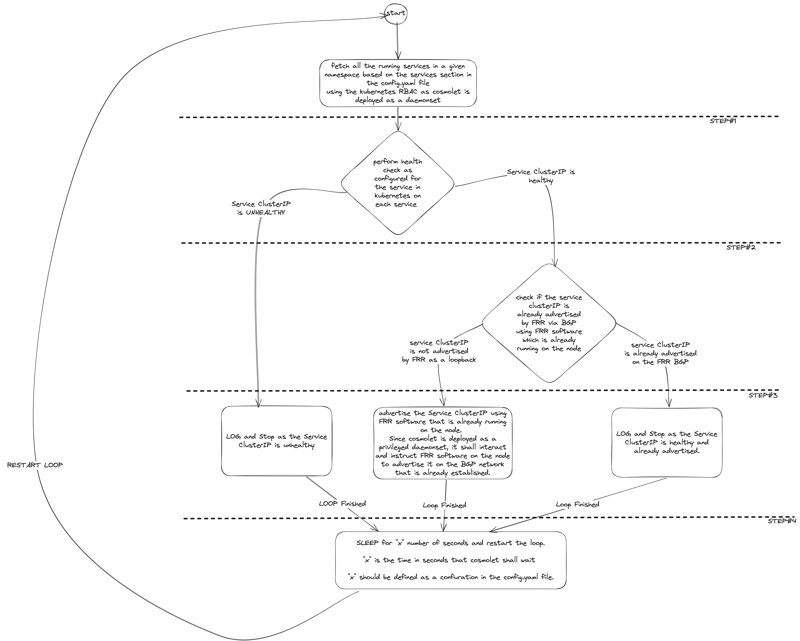

# Cosmolet - BareMetal Kubernetes Services BGP Advertiser

## Release Version: beta
Cosmolet has been functionally tested and deemed working. 
Testing at scale is in progress.

Cosmolet is a Kubernetes controller that automatically advertises Kubernetes service IPs via BGP. It runs as a privileged DaemonSet with direct FRR (Free Range Routing) integration to enable bare-metal Kubernetes clusters to announce service IPs to network infrastructure.

## 🚀 Features

Reference Network Architecture


- **Automatic Service Discovery**: Monitors all Kubernetes services across the cluster
- **BGP Route Advertisement**: Integrates with FRR to advertise ClusterIP and LoadBalancer service IPs
- **Health-based Routing**: Only advertises routes for healthy services with ready endpoints
- **Leader Election**: Ensures only one instance manages BGP routes while maintaining monitoring on all nodes
- **High Availability**: DaemonSet deployment with graceful failover
- **Comprehensive Monitoring**: Prometheus metrics and health checks
- **Security Hardened**: Minimal privileges with proper RBAC configuration

## 📋 Prerequisites

- Kubernetes 1.20+ cluster
- FRR (Free Range Routing) installed on nodes
- BGP-capable network infrastructure (switches/routers)
- Cluster admin permissions for installation

## Code Flowchart


# Build & Release Instructuction
## Clone the repository
```
git clone https://github.com/platformbuilds/cosmolet.git
cd cosmolet
```

## Download dependencies
```
go mod download
```

## Build the binary

### Simple build (dev only)
```
go build -o ./bin/cosmolet ./cmd/cosmolet
```

### Production Build (Optimized)
```
#Build with optimizations (same as used in Dockerfile)
CGO_ENABLED=0 GOOS=linux GOARCH=amd64 go build \
    -ldflags='-w -s -extldflags "-static"' \
    -a -installsuffix cgo \
    -o ./bin/cosmolet \
    ./cmd/cosmolet
```

### Cross-Platform Compilation

```
# Linux (default)
CGO_ENABLED=0 GOOS=linux GOARCH=amd64 go build \
  -ldflags='-w -s -extldflags "-static"' \
  -a -installsuffix cgo \
  -o ./bin/cosmolet-linux-amd64 \
  ./cmd/cosmolet

# macOS
CGO_ENABLED=0 GOOS=darwin GOARCH=amd64 go build \
  -ldflags='-w -s -extldflags "-static"' \
  -a -installsuffix cgo \
  -o ./bin/cosmolet-linux-darwin-amd64 \
  ./cmd/cosmolet

# Windows
CGO_ENABLED=0 GOOS=windows GOARCH=amd64 go build \
  -ldflags='-w -s -extldflags "-static"' \
  -a -installsuffix cgo \
  -o ./bin/cosmolet-windows-amd64 \
  ./cmd/cosmolet

# ARM64 (for ARM-based systems)
CGO_ENABLED=0 GOOS=linux GOARCH=arm64 go build \
  -ldflags='-w -s -extldflags "-static"' \
  -a -installsuffix cgo \
  -o ./bin/cosmolet-linux-arm64 \
  ./cmd/cosmolet
```

### Using the Makefile
The project includes a comprehensive Makefile with various build targets:
```
# Download dependencies
make deps

# Build binary
make build

# Build with all checks (fmt, vet, test)
make check

# Clean build
make clean && make build
```


### Multi-Architecture Build Script
```
#!/bin/bash
# build-all.sh

platforms=("linux/amd64" "linux/arm64" "darwin/amd64" "windows/amd64")

for platform in "${platforms[@]}"
do
    platform_split=(${platform//\// })
    GOOS=${platform_split[0]}
    GOARCH=${platform_split[1]}
    output_name='./bin/cosmolet-'$GOOS'-'$GOARCH
    if [ $GOOS = "windows" ]; then
        output_name+='.exe'
    fi

    env GOOS=$GOOS GOARCH=$GOARCH CGO_ENABLED=0 go build \
        -ldflags='-w -s' \
        -o bin/$output_name ./cmd/cosmolet
        
    if [ $? -ne 0 ]; then
        echo 'An error has occurred! Aborting the script execution...'
        exit 1
    fi
done
```

### Development Build
```
# Build with debug info
go build -gcflags="all=-N -l" -o ./bin/cosmolet-debug ./cmd/cosmolet
```


### Build Flags Explanation

* `-ldflags='-w -s'`: Remove debug info and symbol table (reduces binary size)
* `-extldflags "-static"`: Create statically linked binary
* `CGO_ENABLED=0`: Disable CGO for pure Go binary
* `-a`: Force rebuilding of packages
* `-installsuffix cgo`: Use different install suffix for CGO

### Environment Variables for Build
```
# Set common build environment
export CGO_ENABLED=0
export GOOS=linux
export GOARCH=amd64

# Build with environment
go build -ldflags='-w -s' -o cosmolet ./cmd/main.go
```

## Verification
After building, verify the binary:
```
# Check binary info
file cosmolet
ldd cosmolet  # Should show "not a dynamic executable" for static build

# Test binary
./cosmolet --help
./cosmolet --version
```

## Common Build Issues
* Dependency Issues:
```
go mod tidy
go mod verify
```

* CGO Dependencies:
```
# If you encounter CGO issues, try:
CGO_ENABLED=0 go build ./cmd/main.go
```

* Module Path Issues:
```
# Ensure you're in the correct directory
go mod init github.com/platformcosmo/cosmolet  # if starting fresh
```

The resulting binary will be statically linked and suitable for deployment in containers or bare-metal systems without external dependencies.


## 🤝 Contributing

We welcome contributions! Please see [CONTRIBUTING.md](CONTRIBUTING.md) for details.

## 📄 License

This project is licensed under the GNU Affero General Public License v3.0 - see the [LICENSE](LICENSE) file for details.

---

⭐ If this project helps you, please consider giving it a star on GitHub!
